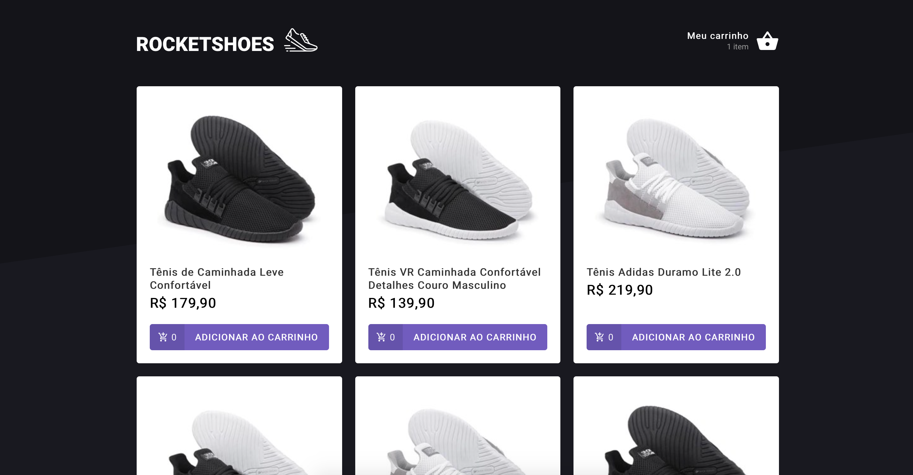
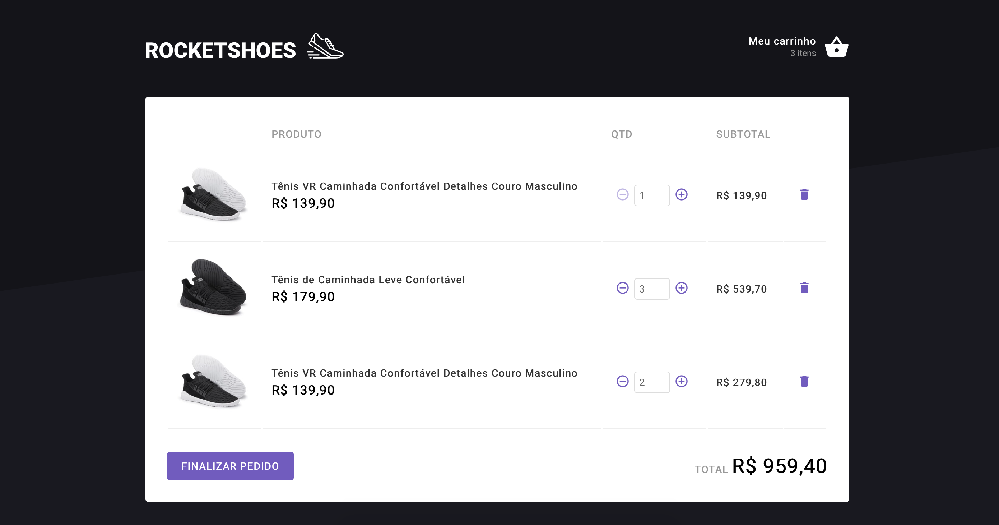

#  🛒 Desafio 03 - Criando um hook de carrinho de compras

<p align="center">
    
</p>

<p align="center">
    
</p>

# 💻 Sobre o desafio

Nesse desafio, você deverá criar uma aplicação para treinar o que aprendeu até agora no ReactJS.

Essa será uma aplicação onde o seu principal objetivo é criar um hook de carrinho de compras. Você terá acesso a duas páginas, um componente e um hook para implementar as funcionalidades pedidas nesse desafio:

- Adicionar um novo produto ao carrinho;
- Remover um produto do carrinho;
- Alterar a quantidade de um produto no carrinho;
- Cálculo dos preços sub-total e total do carrinho;
- Validação de estoque;
- Exibição de mensagens de erro;
- Fake API com JSON Server;
- Preservar dados do carrinho com localStorage API;
- Mostrar erros com toastify.
- Entre outros.

# 🚀 Tecnologias
Esse projeto foi desenvolvido com as seguintes tecnologias:

* [Typescript](https://www.typescriptlang.org/)      
* [React](https://reactjs.org/)      
* [Styled Components](https://styled-components.com/)
* [json-server](https://github.com/typicode/json-server)

# 💻 Execute os seguintes comandos no terminal:

```bash
# Para clonar o repositório 
$ git clone https://github.com/rakelmm/ignite-criando-um-hook-de-carrinho-de-compras.git

```

```bash
# Install Dependencies
$ yarn
# Run Aplication
$ yarn server
# Home
$ http://localhost:3333/
```
---

Feito com ❤️ por Rakel Moreira.
